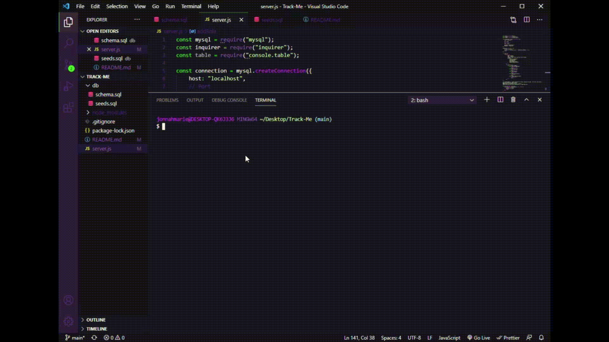

# Track-Me

## Description
This is a Node-based application uses MySQL database and Inquirer NPM package to  view and manage departments, roles, and employees within a company.

## Installation
The user requires the installation of the Inquirer package (npm install inquirer) and MySQL Workbench in order to access the necessary database.

- Run 'npm init' if package.json isn't in the file structure, otherwise fun 'npm install' to install dependencies.
- Run the schema.sql and seed.sql scripts into MySQL Workbench

## Usage
Run the command (below) and go through the prompted application choices to view the employee database.
```
node server.js
```

To view a video demo, click [here](https://drive.google.com/file/d/16wNfj3cBKIulO2yH7y0mmaE5E8BndizB/view?usp=sharing).



## License
 MIT License

Copyright (c) 2021 Jonnah Marie Pangilinan

Permission is hereby granted, free of charge, to any person obtaining a copy
of this software and associated documentation files (the "Software"), to deal
in the Software without restriction, including without limitation the rights
to use, copy, modify, merge, publish, distribute, sublicense, and/or sell
copies of the Software, and to permit persons to whom the Software is
furnished to do so, subject to the following conditions:

The above copyright notice and this permission notice shall be included in all
copies or substantial portions of the Software.

THE SOFTWARE IS PROVIDED "AS IS", WITHOUT WARRANTY OF ANY KIND, EXPRESS OR
IMPLIED, INCLUDING BUT NOT LIMITED TO THE WARRANTIES OF MERCHANTABILITY,
FITNESS FOR A PARTICULAR PURPOSE AND NONINFRINGEMENT. IN NO EVENT SHALL THE
AUTHORS OR COPYRIGHT HOLDERS BE LIABLE FOR ANY CLAIM, DAMAGES OR OTHER
LIABILITY, WHETHER IN AN ACTION OF CONTRACT, TORT OR OTHERWISE, ARISING FROM,
OUT OF OR IN CONNECTION WITH THE SOFTWARE OR THE USE OR OTHER DEALINGS IN THE
SOFTWARE.

